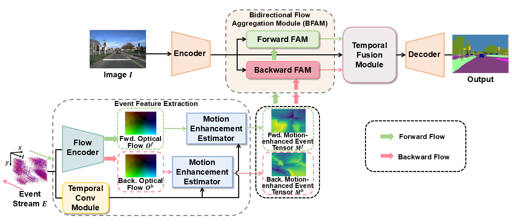

[](https://paperswithcode.com/sota/semantic-segmentation-on-dsec?p=rethinking-rgb-event-semantic-segmentation)
[](https://paperswithcode.com/sota/semantic-segmentation-on-ddd17?p=rethinking-rgb-event-semantic-segmentation)

# Rethinking RGB-Event Semantic Segmentation with a Novel Bidirectional Motion-enhanced Event Representation

[Zhen Yao](https://zyaocoder.github.io/), [Xiaowen Ying](https://www.xiaowenying.com/), [Mooi Choo Chuah](https://www.cse.lehigh.edu/~chuah/).<br>

### [Paper]() | [Project page](https://github.com/AnonymousCVCoder/BRENet)

This repository contains the official Pytorch implementation of training & evaluation code and the pretrained models for BRENet.

<div align="center">
  
</div><br/>

## Installation

```
conda env create --file environment.yml
conda activate BRENet
pip install torch==1.9.1+cu111 torchvision==0.10.1+cu111 -f https://download.pytorch.org/whl/torch_stable.html
conda install -c conda-forge cudatoolkit-dev==11.1.1
pip install mmcv-full==1.3.0 -f https://download.openmmlab.com/mmcv/dist/cu111/torch1.9.1/index.html
pip install timm==0.4.12
pip install ipython
pip install einops
pip install attrs
pip install yapf==0.40.1
pip install opencv-python==4.5.1.48
cd BRENet && pip install -e . --user
```

## Data preparation
Please follow [DATASET.md](assets/readmes/DATASET.md) to prepare the datasets. <br>

## Trained Models
We provide trained weights for our models reported in the paper. All of the models were evaluated with 1 NVIDIA RTX A5000 GPU, and can be reproduced with the evaluation script above.

|Dataset|Backbone|Resolution|mIoU|Accuracy|Download Link|
|:-:|:-:|:-:|:-:|:-:|:-:|
|DDD17|MiT-B2|200*346|78.56|96.61|[[Google Drive](https://drive.google.com/file/d/1IWC01V6o6Excduw1CzQ_UQPSMTKOSFf6/view?usp=drive_link)] / [[OneDrive](https://1drv.ms/u/s!Ai-2eP0j16e5bGTezxL8hg6SZ0I?e=8iF2Xr)]|
|DSEC|MiT-B2|440*640|74.94|95.85|[[Google Drive](https://drive.google.com/file/d/1LYxaQmMmawh8552FxBeVJA5kgLbjcJtj/view?usp=drive_link)] / [[OneDrive](https://1drv.ms/u/s!Ai-2eP0j16e5bQVF_I9yf8LqrtM?e=tYhFm0)]|

## Evaluation
```
# Single-gpu testing
python tools/test.py local_configs/BRENet/brenet.b2.640x440.dsec.80k.py /path/to/checkpoint_file
python tools/test.py local_configs/BRENet/brenet.b2.346x200.ddd17.160k.py /path/to/checkpoint_file
```

## Training
Download `backbone weights` of [MiT-B2](https://connecthkuhk-my.sharepoint.com/:f:/g/personal/xieenze_connect_hku_hk/EvOn3l1WyM5JpnMQFSEO5b8B7vrHw9kDaJGII-3N9KNhrg?e=cpydzZ) pretrained on ImageNet-1K, and put it in the folder ```pretrained/```.
Download FlowNet weights: `Checkpoint trained on DSEC` of [eRaft](https://github.com/uzh-rpg/E-RAFT/tree/main) in and put it in the folder ```pretrained/```.

```
# Single-gpu training
python tools/train.py local_configs/BRENet/brenet.b2.640x440.dsec.80k.py
python tools/train.py local_configs/BRENet/brenet.b2.346x200.ddd17.160k.py

# Multi-gpu training
./tools/dist_train.sh local_configs/BRENet/brenet.b2.640x440.dsec.80k.py <GPU_NUM>
./tools/dist_train.sh local_configs/BRENet/brenet.b2.346x200.ddd17.160k.py <GPU_NUM>
```

## License
This repository is under the Apache-2.0 license. For commercial use, please contact with the authors.

## Acknowledgement
This codebase is built based on MMSegmentation. We thank MMSegmentation for their great contributions.

## Citation
Please cite our paper and other related works if you find this useful:
```
```

EVSNet: Event-guided low-light video semantic segmentation
```
@article{yao2024event,
  title={Event-guided low-light video semantic segmentation},
  author={Yao, Zhen and Chuah, Mooi Choo},
  journal={arXiv preprint arXiv:2411.00639},
  year={2024}
}
```
